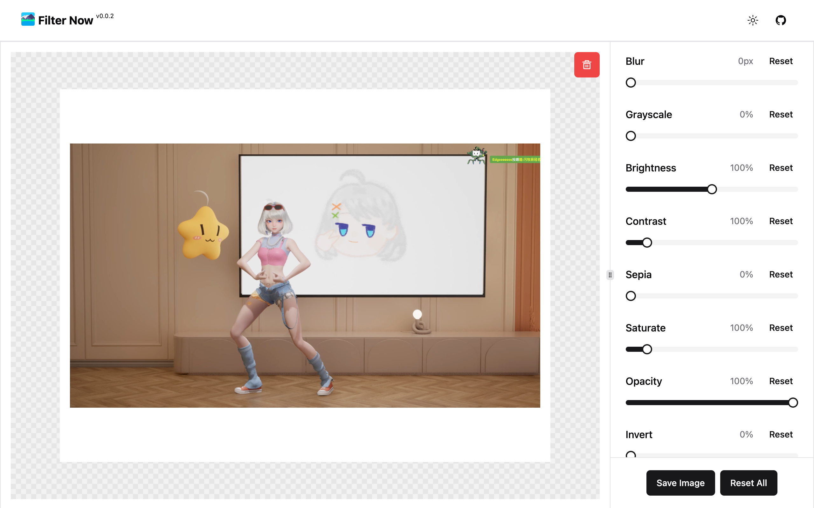
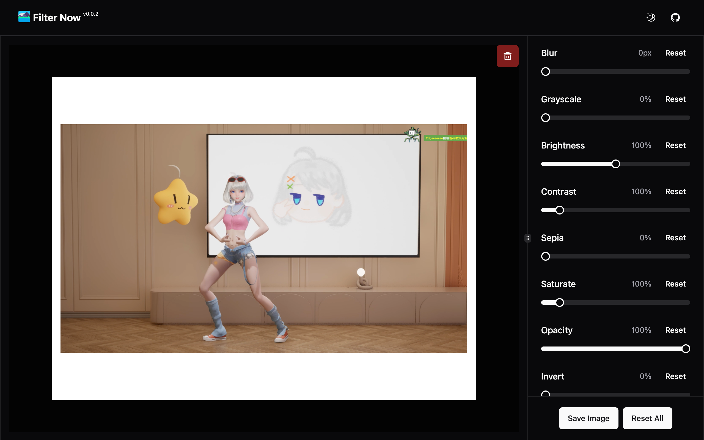

# filter-now

> An offline tool help user to add CSS based filter to image and save it.

## Install

[link-chrome]: https://chromewebstore.google.com/detail/filter-now/nnpbddimdhgfilklodgmcphiandhjfbk 'Version published on Chrome Web Store'
[link-firefox]: https://addons.mozilla.org/zh-CN/firefox/addon/filter-now 'Version published to Mozilla Addons'

[][link-chrome] [][link-chrome] and other Chromium browsers

[][link-firefox] [][link-firefox]

## Screenshots

## Credits

- Built on top of [WXT](https://wxt.dev/), the next-gen web extension framework

## License

[MIT](./LICENSE) License © 2024 to PRESENT [ntnyq](https://github.com/ntnyq)
